Tehtävät suoritettiin PoP!_OS-käyttöjärjestelmällä varustetulla isäntäkoneella. Laitteiston kokoonpano:

- Prosessori: AMD Ryzen 7 7700x
- Näytönohjain: Nvidia RTX 4070
- Muisti: 32 GB DDR5 RAM 6000mhz cl 32

Isäntäkoneella ajettiin Kali Linux -virtuaalikonetta, jolla oli seuraavat asetukset:

- Muisti: 4 GB RAM
- Prosessorit: 3
_______

## x) Lue ja tiivistä. Karvinen 2025: [Wireshark - Getting Started](https://terokarvinen.com/wireshark-getting-started/) Karvinen 2025: [Network Interface Names on Linux](https://terokarvinen.com/network-interface-linux/)

##### Wireshark - Getting Started

- Wireshark on työkalu verkkoliikenteen tarkasteluun ja analysointiin.
- Sillä voi **kaapata verkkopaketteja**, tarkastella niitä reaaliajassa tai myöhemmin (.pcap-tiedostoista).
- Käyttöön kuuluu myös **suodattimien** käyttö, kuten `dns`, `http` tai `ip.addr == x.x.x.x`, joilla haetaan tiettyä liikennettä.

##### Network Interface Names on Linux

- Verkkoliittymät (kuten `enp1s0`, `wlp4s0`, `lo`) ovat nimiä eri verkkokorteille.
- `en` = Ethernet, `wl` = WiFi, `lo` = loopback (localhost).
- Nimet tulevat **systemd:n** käyttämästä järjestelmästä.
- Omia liittymiä voi tarkastella komennolla `ip a`.

## a)
Virtuaalikoneessa käytössä Kali Linux.

## b) Ei voi kalastaa. Osoita, että pystyt katkaisemaan ja palauttamaan virtuaalikoneen Internet-yhteyden.

Poistin verkkoyhteyden menemällä virtuaalikoneen asetuksissa kohtaan _Network_ ja poistamalla valinnan _Enable Network Adapter_. Tämä katkaisi yhteyden.  

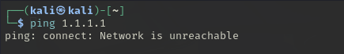

Palautin verkon laittamalla asetuksen takaisin päälle ja käynnistämällä virtuaalikoneen uudelleen – verkkoyhteys toimi taas.

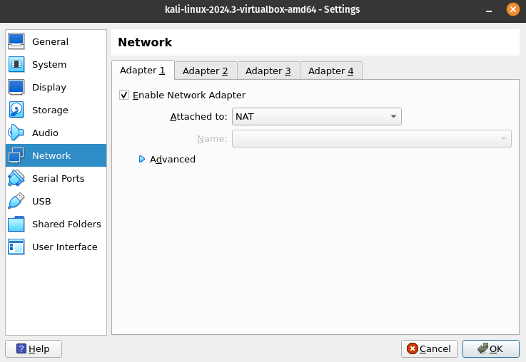

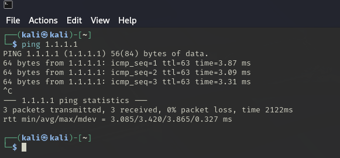

## c) Wireshark. Asenna Wireshark. Sieppaa liikennettä Wiresharkilla.

Wireshark oli valmiiksi asennettuna virtuaalikoneessani.  
Aloitin kaappauksen liitännästä `eth0` ja avasin Firefoxin, jotta verkkoliikennettä syntyisi analysoitavaksi.

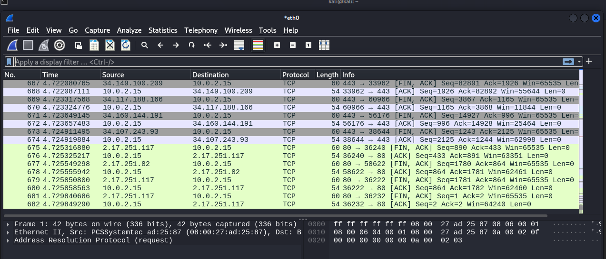

## d) Oikeesti TCP/IP. Osoita TCP/IP-mallin neljä kerrosta yhdestä siepatusta paketista.

Valitsin kaapatusta liikenteestä HTTP-paketin (Frame 39), joka sisältää kaikki TCP/IP-mallin neljä kerrosta:

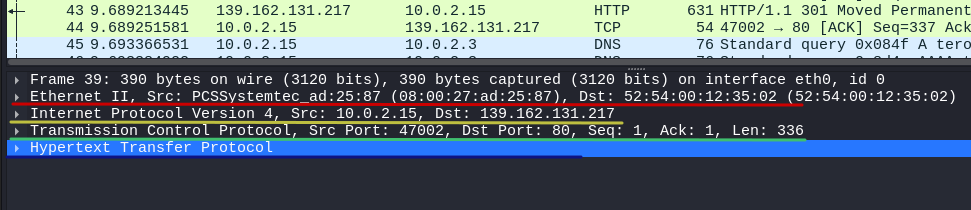

- Sovelluskerros: HTTP
- Kuljetuskerros: TCP (portit 47002 → 80)
- Verkkokerros: IPv4 (10.0.2.15 → 139.162.131.217)
- Linkkikerros: Ethernet II (MAC-osoitteet)

## e) Mitäs tuli surffattua? Avaa surfing-secure.pcap. Tutustu siihen pintapuolisesti ja kuvaile, millainen kaappaus on kyseessä. Tässä siis vain lyhyesti ja yleisellä tasolla. Voit esimerkiksi vilkaista, montako konetta näkyy, mitä protokollia pistää silmään. Määrästä voit arvioida esimerkiksi pakettien lukumäärää, kaappauksen kokoa ja kestoa.

Kaappaus kestää noin 7,53 sekuntia ja sisältää 283 pakettia. 

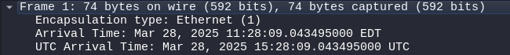

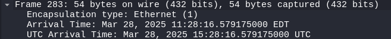

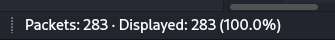

Liikenteessä esiintyy DNS-, TCP-, TLS- ja QUIC-protokollia. Näyttää siltä, että käyttäjä on vieraillut google.com- ja terokarvinen.com-sivustoilla.

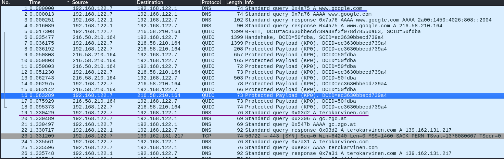

## f) Mitä selainta käyttäjä käyttää?

Yleensä selaimen tiedot löytyvät HTTP-headereista, kuten user agent-kentästä. Tässä kaappauksessa kyseinen tieto ei ollut nähtävillä, koska yhteys oli suojattu TLS-salauksella, eikä HTTP-pyyntöjä näkynyt. Siksi selainta joutui kaivelemaan vaikean kautta.

TLS-yhteyden Client Hello -paketista löytyi [JA3-fingerprint](https://engineering.salesforce.com/tls-fingerprinting-with-ja3-and-ja3s-247362855967/). Se on "sormenjälki", joka kertoo, millaisia salausmenetelmiä ja muita asetuksia selain tukee. Näitä tietoja voi verrata tunnettuun listaan, ja sitä kautta pystytään päättelemään, mitä selainta on todennäköisesti käytetty

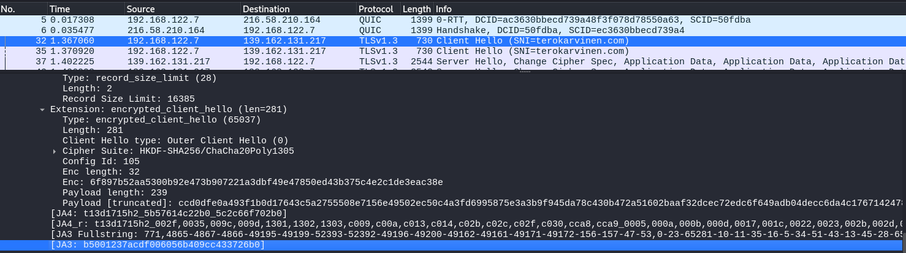

Otin ja3 hashin `b5001237acdf006056b409cc433726b0` ja tämä hash tarkistettiin verkkopalvelusta  [JA3.ZONE](https://ja3.zone/) ja sen perusteella käyttäjän selain vaikuttaa olevan Firefox.

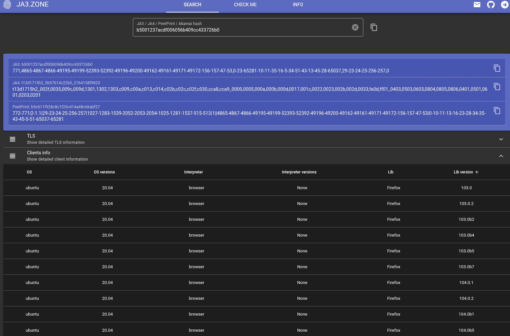

## g) Minkä merkkinen verkkokortti käyttäjällä on?

Kaapatun liikenteen MAC-osoite on `52:54:00:2f:e1:e5`, joka on lokaalisti hallittu osoite[(LAA)](https://macaddress.io/faq/what-are-a-universal-address-and-a-local-administered-address). Tämä tarkoittaa, että se ei ole suoraan minkään fyysisen valmistajan vakio-osoite, vaan se on voitu esimerkiksi generoida virtuaalikoneelle. 
Wireshark ei osannut sanoa valmistajaa varmasti, mutta MAC Address Lookupin mukaan wireshark on joskus ilmaissut sen olevan Realtek. 

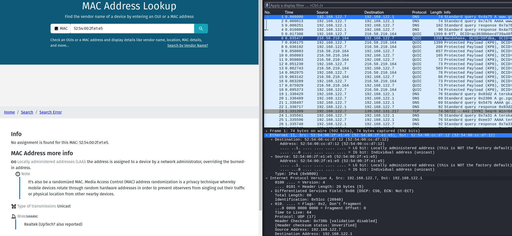

## h) Millä weppipalvelimella käyttäjä on surffaillut?
Käytin Wiresharkissa suodatinta `dns.qry.name`, joka näyttää kaapatun liikenteen DNS-kyselyt. Sillä selvisi, että käyttäjä on surffanut ainakin google.com ja terokarvinen.comissa.

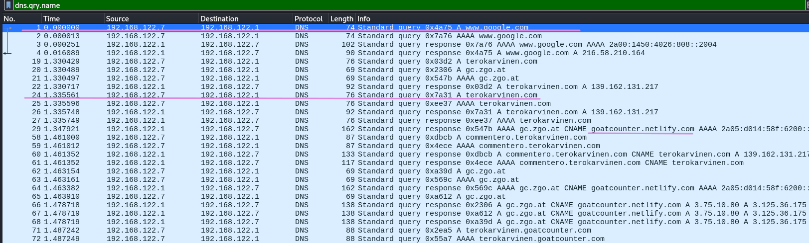

## i) Analyysi

Tarkastelun kohteena on kaksi ensimmäistä pakettia, jotka muodostavat DNS-kyselyn ja -vastauksen.

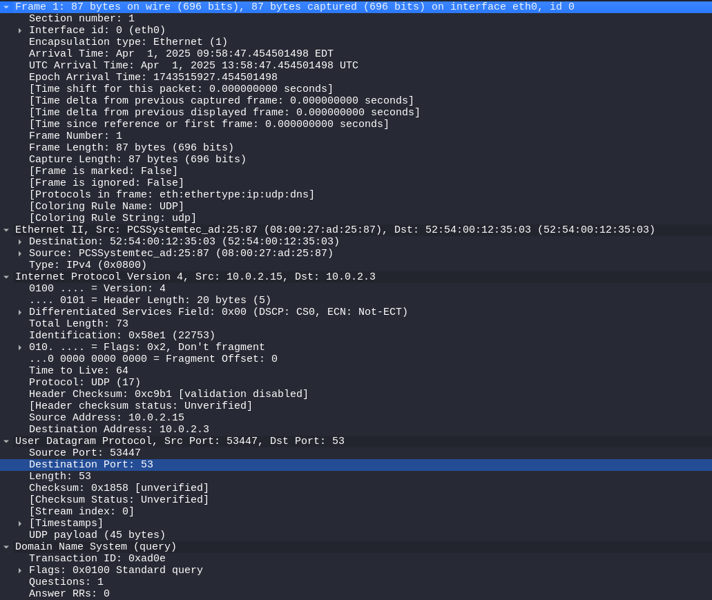

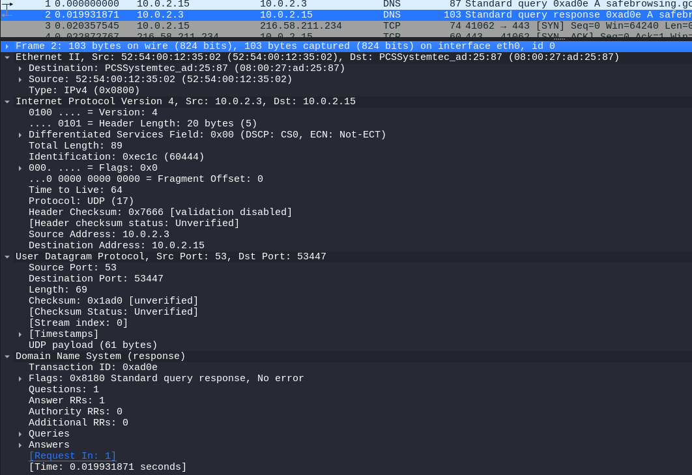

- Ensimmäinen paketti on käyttäjän koneen (10.0.2.15) lähettämä DNS-kysely, joka menee DNS-palvelimelle (10.0.2.3). Kysely käyttää UDP-protokollaa, lähdeporttina 53447 ja kohdeporttina 53. 

- Toisessa paketissa näkyy DNS-vastaus, joka tulee samalta palvelimelta takaisin käyttäjän koneelle. Vastaus sisältää yhden DNS-tietueen ja on merkitty virheettömäksi (`No error`).

- Pakettien välinen aika on noin 0,02 sekuntia, eli kyselyyn vastattiin nopeasti.

- Koko vaihto on osa nimipalvelun toimintaa. Käyttäjä haluaa tietää domain-nimen IP-osoitteen ennen varsinaista yhteyttä.

## Lähteet

Karvinen, T. 2025. Wireshark - Getting Started. Luettavissa: https://terokarvinen.com/wireshark-getting-started/

Karvinen, T. 2025. Network Interface Names on Linux. Luettavissa: https://terokarvinen.com/network-interface-linux/

Althouse, J. s.a. TLS Fingerprinting with JA3 and JA3S. Luettavissa: https://engineering.salesforce.com/tls-fingerprinting-with-ja3-and-ja3s-247362855967/

macaddress.io. s.a. What are a universal address and a local administered address?. Luettavissa: https://macaddress.io/faq/what-are-a-universal-address-and-a-local-administered-address
