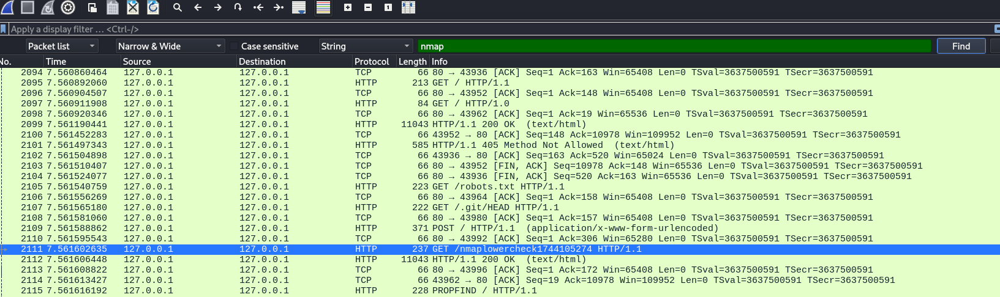

## x)

##### [Pyramid of pain](https://detect-respond.blogspot.com/2013/03/the-pyramid-of-pain.html)
Pyramid of Pain näyttää, kuinka paljon haittaa puolustaja voi aiheuttaa hyökkääjälle estämällä eri tyyppisiä indikaattoreita. Mitä korkeampi taso, sitä vaikeampi on kiertää, ja sitä enemmän se sattuu hyökkääjään.

##### [Diamond Model](https://www.eccouncil.org/cybersecurity-exchange/ethical-hacking/diamond-model-intrusion-analysis/)
Diamond Model on malli, joka kuvaa kyberhyökkäyksen neljä keskeistä elementtiä: hyökkääjä, uhri, käytetty infrastruktuuri ja hyökkäyksen kyvykkyydet. Mallin avulla analysoidaan näiden elementtien välisiä suhteita ja saadaan kokonaiskuva hyökkäyksen kulusta ja taustasta.

## a)  _Apache log_.
Apache oli valmiiksi asennettuna, joten käynnistin palvelimen komennolla `sudo systemctl start apache2` ja avasin selaimessa osoitteen `http://localhost`, jolloin Apache palautti oletussivun.

Sivulatauksen jälkeen tutkin logeja tiedostosta `/var/log/apache2/access.log`, jonne Apache tallentaa HTTP-pyynnöt. Etsin sieltä omaa sivulataustani vastaavan logirivin.

`::1 - - [07/Apr/2025:14:53:45 -0400] "GET / HTTP/1.1" 200 3383 "-" "Mozilla/5.0 (X11; Linux x86_64; rv:128.0) Gecko/20100101 Firefox/128.0"`

- `::1`: Asiakkaan IP-osoite. yhteys tuli paikallisesti samalta koneelta.
- `- -`: Apache jättää identiteetti ja autentikointikentät tyhjiksi, koska ne eivät ole käytössä.
- `[07/Apr/2025:14:53:45 -0400]`: Aikaleima. Tieto siitä, milloin pyyntö vastaanotettiin.
- `"GET / HTTP/1.1"`: HTTP-pyyntö.
- `200`: HTTP-statuskoodi.
- `3383`: Palvelimen vastauskoko tavuina (HTML-sivun koko).
- `"-"`: Viittaava osoite (referrer) puuttuu, koska avasin sivun suoraan ilman, että tulin muulta sivulta.
- `"Mozilla/5.0 (...) Firefox/128.0"`: Käyttäjäagentti. Tiedot selaimesta ja käyttöjärjestelmästä.

## b) _Nmapped_.
Ajoin komennon `sudo nmap -A localhost`

- Portti 80/tcp on auki, ja sen takana toimii HTTP-palvelu.
- Palveluversio tunnistettu: Apache HTTP Server versio 2.4.63 Debian-jakelussa.
- http-title: Sivun otsikoksi tunnistettiin "Apache2 Debian Default Page: It works", mikä on apachen oletussivu.
- http-server-header: Palvelimen HTTP-otsakkeessa näkyy myös palvelinohjelmisto ja versio: `Apache/2.4.63 (Debian)`.
- Käyttöjärjestelmä: Nmap arvioi, että palvelin käyttää Linuxin ydintä versiosta 2.6.32 aina 6.2:een asti. (Tämä tunnistus ei ole täysin tarkka, koska se perustuu sormenjälkiin.)
- Verkkoetäisyys: 0 hops-> tarkoittaa, että kone on paikallinen (eli skannaus tehtiin localhostista omalle koneelle).

## c) _Skriptit_.
Parametri `-A` aktivoi automaattisesti palveluiden tunnistuksen, käyttöjärjestelmän tunnistuksen, tracerouten sekä useita nmapin skriptejä.

Skannauksen tuloksissa näkyi portin 80 (HTTP) alla seuraavat skriptit:

- `http-title`: näyttää sivun title-elementin. Tässä tapauksessa: "Apache2 Debian Default Page: It works"
- `http-server-header`: hakee palvelimen HTTP-otsakkeesta version ja ohjelmiston. Tässä: Apache/2.4.63 (Debian)

## d) _Jäljet lokissa_
Porttiskannauksen jälkeen tarkastelin Apache-palvelimen logeja`/var/log/apache2/access.log` ja etsin merkkejä siitä, että nmapin skriptit olisivat jättäneet jälkiä. 

Löysin useita rivejä, joissa user-agent on selkeästi Nmapin jättämä:

`"Mozilla/5.0 (compatible; Nmap Scripting Engine; https://nmap.org/book/nse.html)"`

Lisäksi skannaus näkyi epätavallisina HTTP-metodeina ja pyyntöinä erikoisiin polkuihin, kuten:
- `PROPFIND /`
- `POST /sdk`
- `GET /.git/HEAD`
- `GET /nmaplowercheck...`
- `SKJC / HTTP/1.1`

Useat pyynnöt tehtiin sekunnin sisällä, ja ne erosivat selvästi normaalista selainliikenteestä. Nämä viittaavat siihen, että porttiskanneri käytti eri npamin skriptejä palvelimen tutkimiseen.

Sanaa "nmap" voi etsiä suoraan lokista esimerkiksi komennolla `grep -i nmap access.log`

## e) _Wire sharking_
Porttiskannauksen aikana kaappasin verkkoliikenteen Wiresharkilla, valitsemalla loopback-liitännän (`lo`), koska skannaus kohdistettiin localhostiin.

Aluksi käytin pelkkää hakutoimintoa ja etsin sanalla **"nmap"** paketin sisällöstä. Tällä löytyi vain yksi osuma.

Myöhemmin huomasin, että käyttämällä display filteriä sanalla `nmap` sain näkyviin useampia paketteja, joissa "nmap" löytyi HTTP-headerin User-Agent-kentästä.

Tämä johtuu siitä, että [Display Filter](https://www.wireshark.org/docs/wsug_html_chunked/ChWorkBuildDisplayFilterSection.html) ei tee pelkkää tekstihakua, vaan suodattaa paketteja niiden rakennekenttien mukaan. Se osaa siis tarkastella esimerkiksi HTTP-protokollan User-Agent-kenttää erikseen ja tunnistaa sieltä sanat kuten “nmap”. Hakutoiminto puolestaan etsii vain raakatekstin perusteella.

## f) _Net grep_

Suoritin verkkoliikenteen sieppauksen `ngrep`-työkalulla, käyttäen komentoa `sudo ngrep -d lo -i nmap`.
- `-d lo`: valitsee loopback-liitännän
- `-i nmap`: etsii tekstin `nmap`

Koska käytin suoraan hakusanaa `nmap`, työkalu näytti vain ne paketit, joiden sisällössä esiintyi kyseinen sana.
## g) _Agentti_ & h) _Pienemmät jäljet_.

Muokkasin Nmapin HTTP-skriptin käyttäytymistä niin, että se ei enää käytä oletusarvoista Nmapin tunnistettavaa User-Agent-kenttää, vaan näyttää tavalliselta selaimelta. Käytin komentoa `sudo nmap -p 80 --script=http-headers --script-args http.useragent="Mozilla/5.0 (X11; Linux x86_64) AppleWebKit/537.36 (KHTML, like Gecko) Chrome/134.0.0.0 Safari/537.36" localhost`
- `-p 80`: skannaa vain HTTP-porttia
- `--script=http-headers`: ajaa vain yhden skriptin, joka tarkistaa HTTP-headerit
- `--script-args http.useragent=...`: vaihtaa oletusarvoisen user-agentin selaimen näköiseksi
- `localhost`: skannauksen kohde on oma kone

Tarkistin sekä Apachen `access.log`-tiedoston että Wiresharkin kaappauksen.

- `User-Agent` näkyi lokeissa oikeassa muodossa (ei enää viitteitä Nmapiin)
- Hakusanalla `"nmap"` ei löytynyt osumia Wiresharkista (display filter: `frame contains "nmap"`)
- Myöskään Apachen `access.log`-tiedostossa ei ollut mainintaa "nmap"
- HTTP-pyyntö näytti verkkoliikenteessä siltä kuin se tulisi tavalliselta selaimelta

Komento skannasi vain portin 80 ja käytti vain yhtä hyvin "sivistynyttä" skriptiä, jonka HTTP-pyyntö naamioitiin aidon selaimen pyynnöksi. Siksi mitään ei näkynyt logeissa eikä Wiresharkissa.

## i)  _LoWeR ChEcK_

Aiemmissa tehtävissä Nmapin jälkiä piilotettiin vain komentorivin parametrien avulla ja mitään jälkiä ei jäänyt mihinkään, niin ajoin nyt eri komennolla `sudo nmap -T4 -vv -A -p 80 localhost` skannauksen, jotta Nmapista jäisi jokin jälki ja yritin toisella tavalla muokata sen pois.

Tällä kertaa skannauksen jälkeen Apache-lokissa ja Wiresharkin kaapatusta liikenteestä löytyi useita viitteitä Nmapin toimintaan, esimerkiksi HTTP-pyyntö, jossa URL-polku oli `/nmaplowercheck`, sekä User-Agent-kenttä, jossa luki `"Nmap Scripting Engine"`. 

Etsin `/usr/share/nmap`-hakemistosta, mistä tuo nmaplowercheck-polku tuli ja se löytyi tiedostosta `/usr/share/nmap/nselib/http.lua`. Muokkasin tiedostoa siten, että polku `/nmaplowercheck` korvattiin harmittomammalla nimellä `/check`, joka ei herätä (ainakaan yhtä paljon) huomiota.

Samassa tiedostossa löytyi myös kohta, jossa määritellään user-agent. Vaihdoin sen oletusarvoksi selainta muistuttavan merkkijonon: `"Mozilla/5.0 (X11; Linux x86_64) AppleWebKit/537.36 (KHTML, like Gecko) Chrome/134.0.0.0 Safari/537.36"`. Näin HTTP-pyynnöt näyttävät siltä kuin ne tulisivat tavalliselta selaimelta.

Tämän jälkeen ajoin saman Nmap-skannauksen uudestaan ja tarkistin sekä Apachen access.login että Wiresharkin kaappaaman liikenteen. Tällä kertaa sanalle "nmap" ei löytynyt enää yhtään osumaa kummastakaan. Myös HTTP-pyyntöjen rakenne näytti aivan tavalliselta selainliikenteeltä.

## Lähteet

Karvinen, T. 2025 Lempiväri: violetti. Luettavissa: https://terokarvinen.com/verkkoon-tunkeutuminen-ja-tiedustelu/#h2-lempivari-violetti

Wireshark Foundation. Display Filter. Luettavissa: https://www.wireshark.org/docs/wsug_html_chunked/ChWorkBuildDisplayFilterSection.html

Tidmarsh, D. 2023. Diamond Model of Intrusion Analysis: What, Why, and How to Learn . : https://www.eccouncil.org/cybersecurity-exchange/ethical-hacking/diamond-model-intrusion-analysis/

Bianco, D. 2013. The Pyramid of Pain. Luettavissa: https://detect-respond.blogspot.com/2013/03/the-pyramid-of-pain.html

Nmap. Library http. https://nmap.org/nsedoc/lib/http.html

Nmap. Nmap Scripting Engine. https://nmap.org/book/man-nse.html
