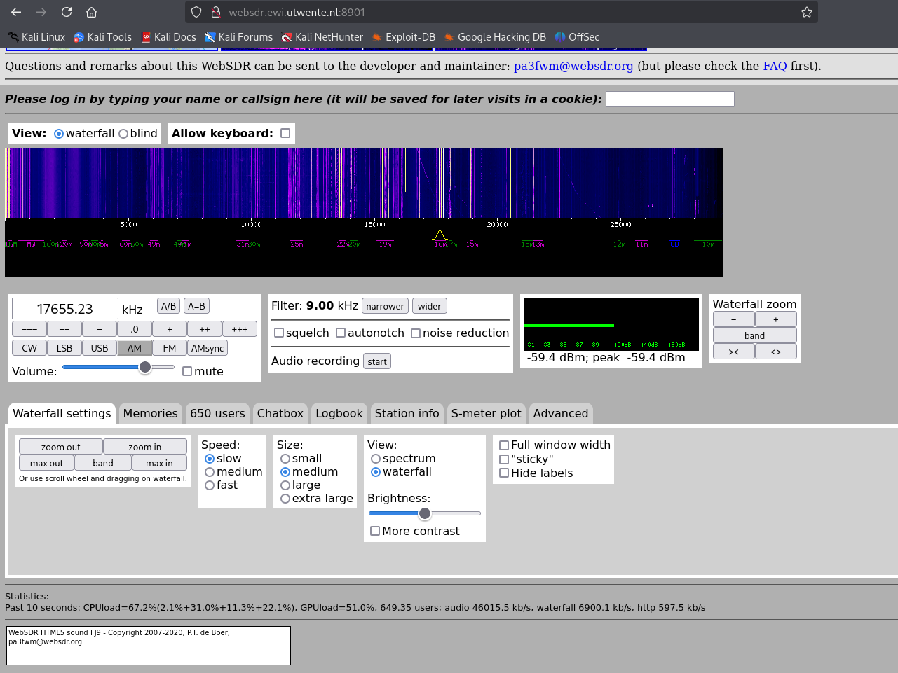
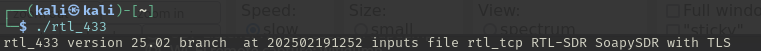
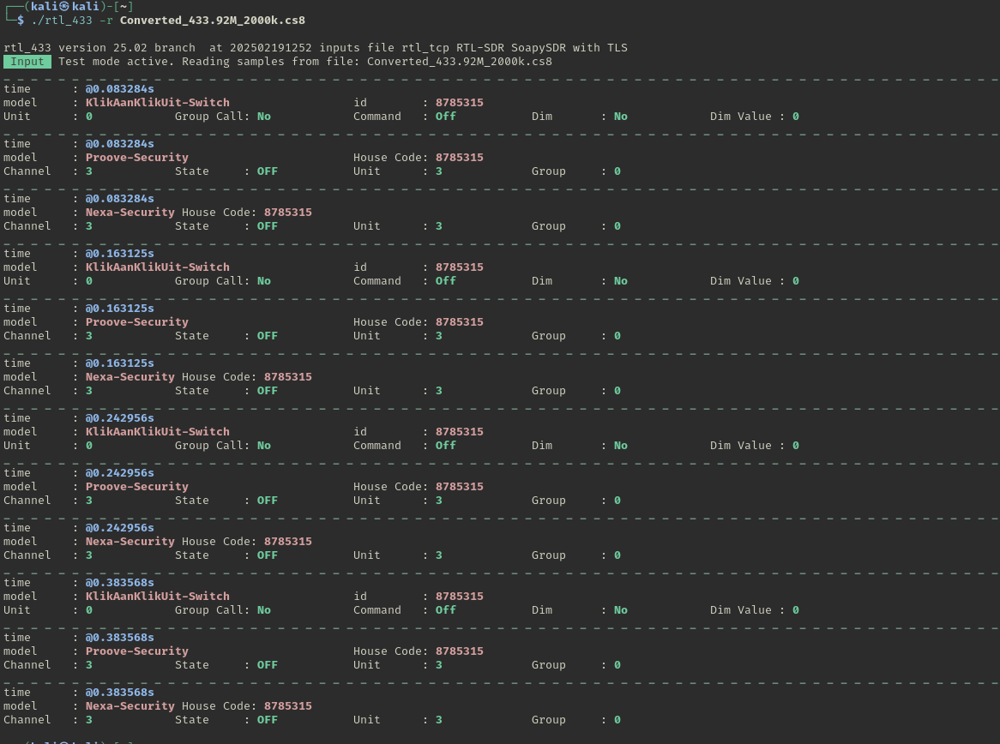
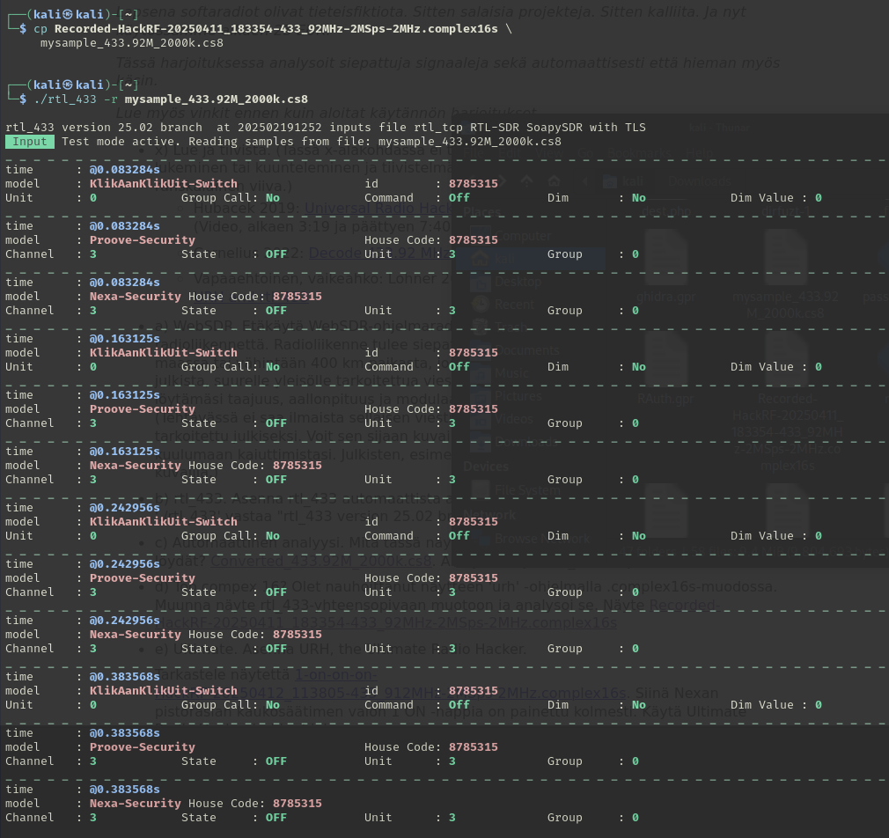
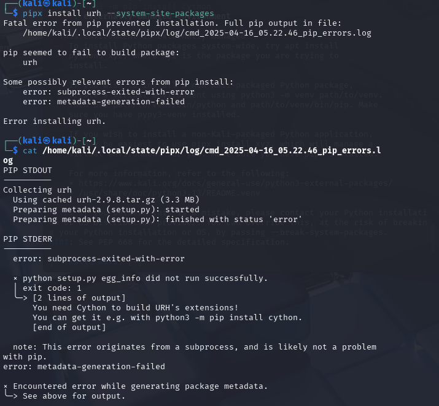
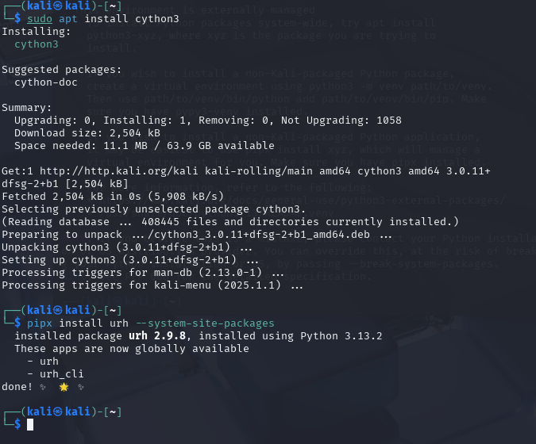
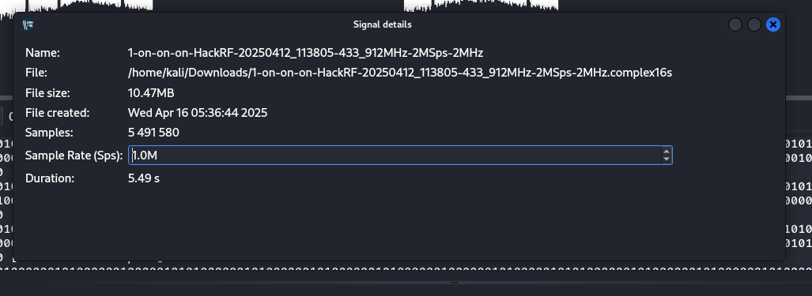
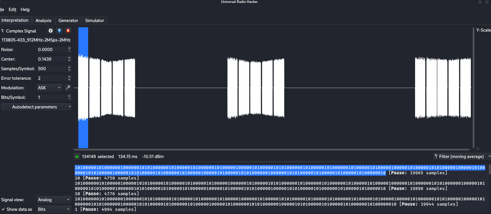
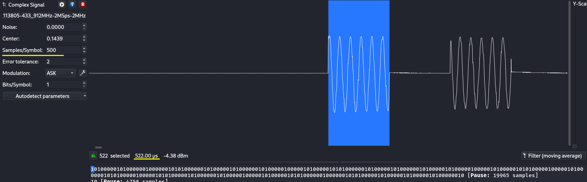

## x) Lue ja tiivistä

[Universal Radio Hacker SDR Tutorial on 433 MHz radio plugs](https://www.youtube.com/watch?v=sbqMqb6FVMY&t=199s)
- Videolla esitellään, miten URH-sovelluksella nauhoitetaan radiosignaali ja analysoidaan se bittitasolla.

[Decode 433.92 MHz weather station data](https://www.onetransistor.eu/2022/01/decode-433mhz-ask-signal.html)
- Artikkelissa esitellään, miten RTL-SDR-laitteella ja `rtl_433`-ohjelmalla voidaan vastaanottaa ja purkaa sääaseman lähettämää dataa taajuudella 433.92 MHz.
- Artikkeli opastaa mm. signaalin tallentamiseen, modulaation tunnistamiseen, demodulointiin ja oman dekooderin luomiseen URH:ssa. 
## a) WebSDR.

Käytin Twenten yliopiston WebSDR-vastaanotinta Alankomaissa (n. 1700 km Suomesta). Kuuntelin lähetystä taajuudella 17655.23 kHz, josta kuului selkeää puhetta ja musiikkia. Kyseessä oli todennäköisesti jokin yleisradiokanava, mutta en pystynyt tarkasti tunnistamaan mitä asemaa kuuntelin.

- Taajuus: 17655.23 kHz
- Modulaatio: AM (Amplitude Modulation)  

## b) rtl_433
Asensin tarvittavat paketit komennolla `sudo apt-get -y install atool wget libssl-dev libtool libusb-1.0-0-dev librtlsdr-dev rtl-sdr libsoapysdr-dev`

Asennus meni läpi ja ajoin komennon `./rtl_433`

Komento toimi ja palautti versionumeron, eli vaikuttaisi siltä että rtl_433 asentui oikein

## c) Automaattinen analyysi
Analysoin näytteen `Converted_433.92M_2000k.cs8` käyttämällä komentoa `./rtl_433 -r Converted_433.92M_2000k.cs8`.

Ohjelma näytti tunnistavan useita erilaisia signaaleja, jotka liittyivät ilmeisesti kodin automaatioon tai turvalaitteisiin. Protokollista mainittiin ainakin KlikAanKlikUit-Switch, Proove-Security ja Nexa-Security.

Tunnistetut tiedot:

- ID / House Code: 8785315  
    (sama kaikissa viesteissä, viittaa samaan järjestelmään)
- KlikAanKlikUit-Switch:
    - Command: Off
    - Unit: 0
    - Dim: No
- Proove-Security & Nexa-Security:
    - Channel: 3
    - Unit: 3
    - State: _OFF_
    - Group: 0

Signaalit toistuivat useaan kertaan eri aikaleimoilla. Kaikki signaalit liittyivät komentoon kytkeä laite pois päältä (OFF).

Koska kolme eri protokollaa (KlikAanKlikUit, Proove ja Nexa) viittaavat samaan tunnisteeseen (8785315), kyse on todennäköisesti yhdestä kotiautomaatiolaitteistosta.

## d) Too complex 16?

Tarkasteltavana oli radiosignaalinäyte `Recorded-HackRF-20250411_183354-433_92MHz-2MSps-2MHz.complex16s`, joka oli tallennettu URH-ohjelmalla. Tiedosto oli muodossa `.complex16s`, eli se sisälsi 16-bittistä kompleksinäytettä (tai jotain sinne päin). `rtl_433` ei normaalisti käsittele tätä formaattia suoraan, vaan käyttää yleensä 8-bittistä `cs8`-muotoa. Ohjeiden mukaan `rtl_433` voi kuitenkin käsitellä `.complex16s`-tiedostoja, kunhan tiedoston nimessä on mukana taajuus- ja näytteenottotiedot.

Nimesin tiedoston uudelleen `cp Recorded-HackRF-20250411_183354-433_92MHz-2MSps2MHz.complex16s \mysample_433.92M_2000k.cs8`.
Nimen muoto (`433.92M_2000k`) kertoo `rtl_433`:lle, että signaali on nauhoitettu taajuudella 433.92 MHz ja sample rate 2000k.

- KlikAanKlikUit-Switch
    - ID: 8785315
    - Unit: 0
    - Command: OFF
- Proove-Security
    - House Code: 8785315
    - Channel: 3
    - Unit: 3
    - State: OFF
- Nexa-Security
    - House Code: 8785315
    - Channel: 3
    - Unit: 3
    - State: OFF

Kaiken kaikkiaan tiedoston uudelleennimeäminen riitti siihen, että `rtl_433` osasi lukea sen ja sai siitä dataa ulos. Näytti taas olevan jotain kodin automaatioon liittyviä juttuja ja kaikissa oli sama ID 8785315, joten varmaan sama laite tai järjestelmä lähetti ne kaikki.

## e) Ultimate

URH:n asennuksessa ilmeni aluksi ongelma, kun asennus kaatui virheeseen, jonka mukaan `Cython`-kirjastoa ei löytynyt, vaikka se oli `pipx`:n kautta jo asennettu. Tämä vaikutti oudolta, mutta selvisi, että ongelma liittyi siihen, ettei pipx:n erillinen ympäristö löytänyt järjestelmätason Cythonia.

Löysin tähän vastauksen [URH:n suljetusta GitHub-issuesta](https://github.com/jopohl/urh/issues/1064), jossa suositeltiin Cythonin asentamista suoraan APT:n kautta `sudo apt install cython3`. 
Tämän jälkeen URH:n asennus onnistui normaalisti `pipx install urh`.

Tällä tavalla URH asentui myös käyttöpolkuun suoraan, joten `pipx ensurepath` -komentoa ei tarvinnut käyttää, vaikka se mainittiin ohjeessa. URH:n graafinen käyttöliittymä käynnistyi onnistuneesti komennolla `urh`

## f) Yleiskuva

Avasin `1-on-on-on-HackRF-20250412_113805-433_912MHz-2MSps-2MHz.complex16s` tiedoston urh:ssa tarkasteltavaksi.

Tiedoston nimen perusteella (`433_912MHz-2MSps`) voidaan arvella taajuuden olevan 433.912 mhz ja näytteenottotaajuden 2 MSps.

Tutkin signaalin perustietoja URH:n info-paneelista, joka löytyy ohjelman yläkulmasta. Paneelin mukaan näytteen tiedot olivat seuraavat:
- Tiedostokoko: 10.47 MB
- Näytteitä: 5 491 580
- Kesto: 5.49 sekuntia

Signaali näkyy URH:ssa kolmena selkeänä signaaliryppäänä, jotka ilmeisesti vastaavat kolmea kaukosäätimen "valon 1 ON" -painallusta.

## g) Bittistä

Käytin autodetect parameters nappia kuten [hubmartin videossa vinkataan](https://www.youtube.com/watch?v=sbqMqb6FVMY&t=199s). Modulaatioksi valikoitui ASK ja se vaikutti toimivalta.

Valitsin bittinäkymästä hiirellä yhden ykkösbittinä näkyvän osion. Valinnan yhteydessä URH näytti seuraavat tiedot:
- "522 selected"
- "522 µs"
Tämä tarkoittaa, että yksittäinen bitti kesti noin 522 mikrosekuntia, eli noin 0,0005 sekuntia.

## Lähteet

Karvinen, T. 2025. h3 Aaltoja harjaamassa. Luettavissa: https://terokarvinen.com/verkkoon-tunkeutuminen-ja-tiedustelu/#h3-demodulaatiodilemma

Hubmartin. 2019. Universal Radio Hacker SDR Tutorial on 433 MHz radio plugs. Katsottavissa: https://www.youtube.com/watch?v=sbqMqb6FVMY&t=199s

Cornelius. 2022. Decode 433.92 MHz weather station data. Luettavissa: https://www.onetransistor.eu/2022/01/decode-433mhz-ask-signal.html

Jopohl. URH – Universal Radio Hacker. https://github.com/jopohl/urh
