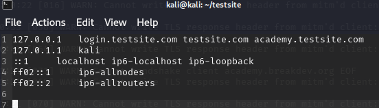
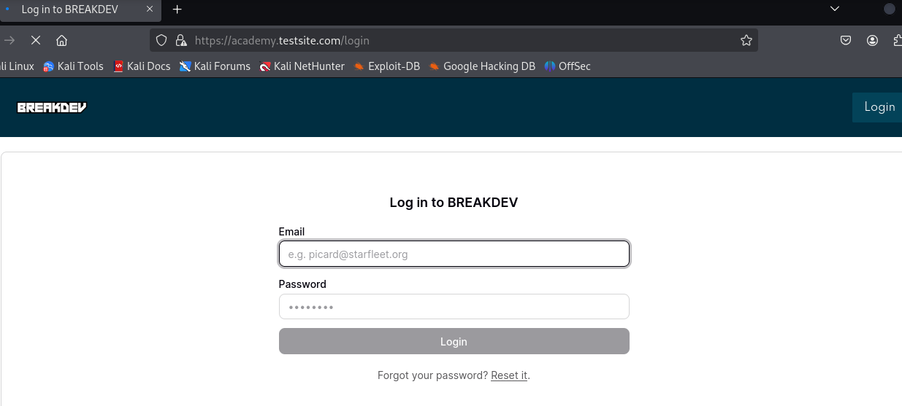
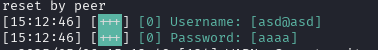
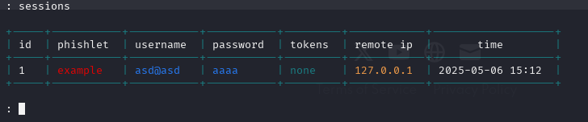
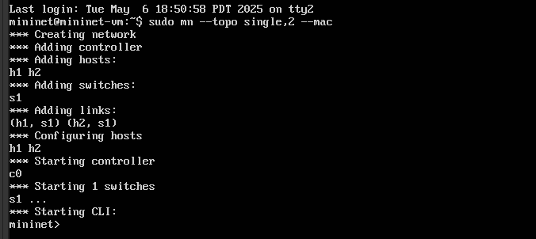
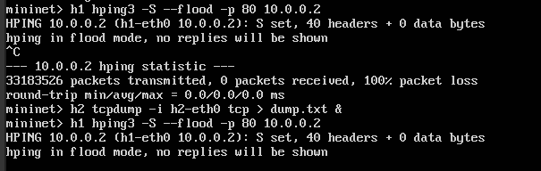
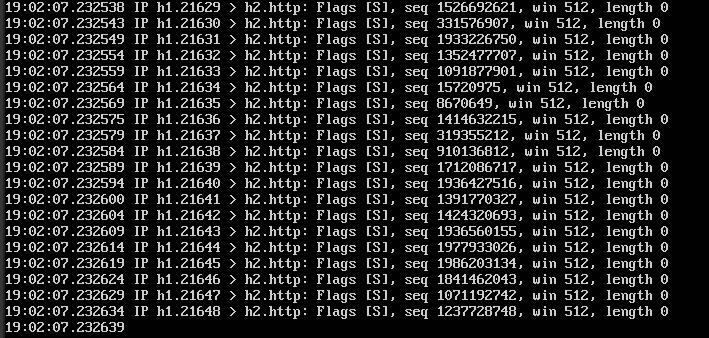

## a)Tutustu Evilginx2 työkaluun

Asensin Evilginx2 Kali Linuxiin `sudo apt install evilginx2` -komennolla.

Koska käytössä ei ollut oikeaa domainia, muokkasin tiedostoa `/etc/hosts`, jotta sain simuloitua hyökkäyksen vain paikallisesti.



Käynnistin Evilginx2 kehittäjätilassa komennolla `evilginx2 -developer`, jotta työkalu käyttäisi itse allekirjoitettuja TLS-varmenteita.

Käytin seuraavia komentoja konfigurointiin:
```
config domain testsite.com
config ipv4 external 127.0.0.1
phishlets hostname example testsite.com
phishlets enable example
lures create example
```

Tämän jälkeen sain URL-osoitteen, jota voi käyttää testiin. `https://academy.testsite.com/RyoQdfdL`

Avasin URL-osoitteen selaimessa. 
Linkki avasi Evilginx Mastery -sivun, joka tuli evilginxin mukana tulevasta `example.yaml`-tiedostosta. Menin sivun kirjautumissivulle nähdäkseni ja syötin kenttiin testi kirjautumistiedot, tarkistaakseni tallentaako Evilginx2 ne.




Evilginx2:n konsoliin ilmestyi tieto vierailijasta.
Kirjautumistietojen jälkeen Evilginxin konsolissa näkyi tunnukset.



Komennolla `sessions` näkyi:



## b) Luo ympäristö, jossa voit tehdä TCP SYN-Flood hyökkäyksen

Tein hyökkäyksen kurssin moodle sivulta ladatulla Mininet-virtuaalikoneella.

Käynnistin verkon `sudo mn --topo single,2 --mac`
Tämä loi verkon, jossa oli kaksi hostia (h1 ja h2) sekä yksi kytkin. Ympäristö varmisti yhteydet automaattisesti.



Hyökkäyksen toteuttamiseksi käytin `hping3`-työkalua, joka oli asennettu mininet isäntäjärjestelmään. Itse hyökkäys laukaistiin `h1`:stä komennolla `h1 hping3 -S --flood -p 80 10.0.0.2`
Komento lähettää nopeasti suuren määrän TCP SYN -paketteja `h2`-koneen porttiin 80



Koska en saanut `xterm` toimimaan, päätin käyttää `tcpdump` ja tallentaa liikenteen tiedostoon. Käytin komentoa `h2 tcpdump -i h2-eth0 tcp > dump.txt &`

Tämä tallensi liikenteen tiedostoon `dump.txt`, jonka sisällön tarkastelin myöhemmin. Komennolla `h2 cat dump.txt | grep S`  näkyviin tuli suuri määrä TCP SYN -paketteja, jotka osoittivat, että hyökkäys ilmeisesti toimi suunnitellusti.


